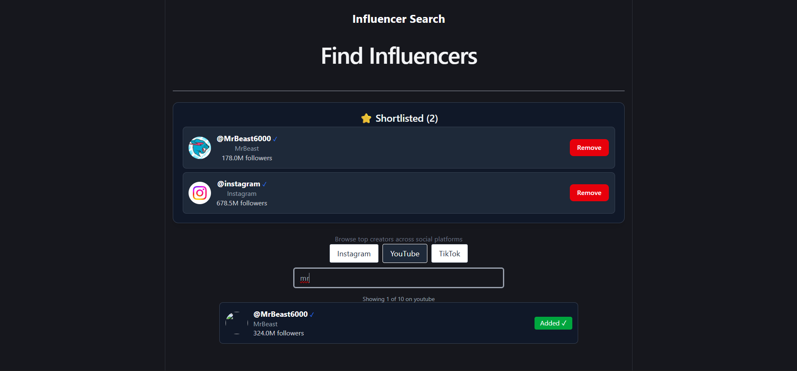
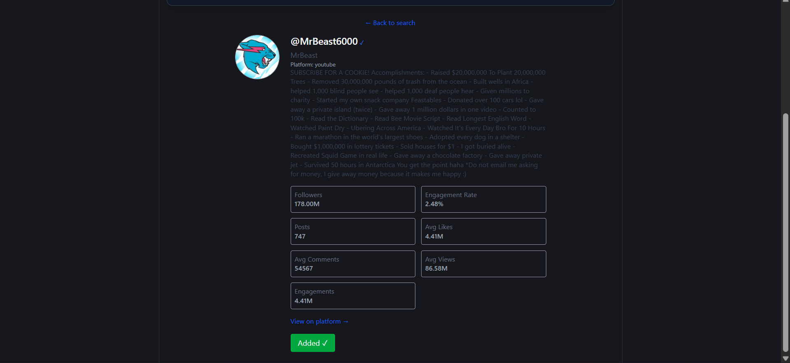
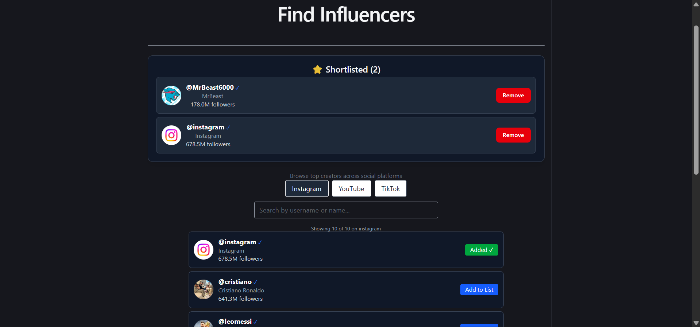

# Wobb Frontend Assignment -- Influencer Search

A React + TypeScript web application for searching influencers across
Instagram, YouTube, and TikTok, viewing profile details, and managing a
persistent shortlist using Zustand.

------------------------------------------------------------------------

## Features

-   Search influencers across Instagram, YouTube, and TikTok
-   View detailed influencer profiles
-   Switch between supported platforms
-   Add influencers to a global shortlist
-   Remove influencers from the shortlist
-   Prevent duplicate shortlist entries
-   Persistent shortlist using localStorage
-   Responsive layout for desktop, tablet, and mobile
-   Production-ready build using Vite

------------------------------------------------------------------------

## Bug Fixes & Improvements

### Fixed Bugs

-   Fixed search crash on YouTube caused by missing `username` values in
    the dataset.
-   Fixed incorrect Engagement Rate calculation.
-   Fixed incorrect Engagements field rendering.
-   Improved responsive layout for smaller screens.
-   Preserved the selected platform when navigating back from profile
    pages.
-   Improved dark theme consistency and overall UI styling.

### New Features

-   Implemented global state management using Zustand.
-   Added **Add to List** functionality.
-   Added **Remove from List** functionality.
-   Implemented persistent shortlist using Zustand Persist
    (localStorage).
-   Added a reusable shortlist panel.
-   Improved UI consistency across search and profile pages.

------------------------------------------------------------------------

## Screenshots

### Search Page



### Profile Page



### Profile Page



------------------------------------------------------------------------

## Tech Stack

-   React 19
-   TypeScript
-   Vite
-   Tailwind CSS
-   React Router
-   Zustand

------------------------------------------------------------------------

## Project Structure

``` text
src/
├── assets/
├── components/
├── pages/
├── store/
├── types/
├── utils/
├── App.tsx
└── main.tsx
```

------------------------------------------------------------------------

## Installation

``` bash
git clone <repository-url>
cd vibe-coder-assignment-main
npm install --legacy-peer-deps
```

## Run Development Server

``` bash
npm run dev
```

## Build for Production

``` bash
npm run build
```

------------------------------------------------------------------------

## Assignment Highlights

-   Implemented Zustand for global state management.
-   Built a persistent influencer shortlist.
-   Fixed multiple runtime and UI bugs.
-   Improved responsiveness across devices.
-   Refined the overall user interface and user experience.

------------------------------------------------------------------------

## Author

**Ayush Mukati**
